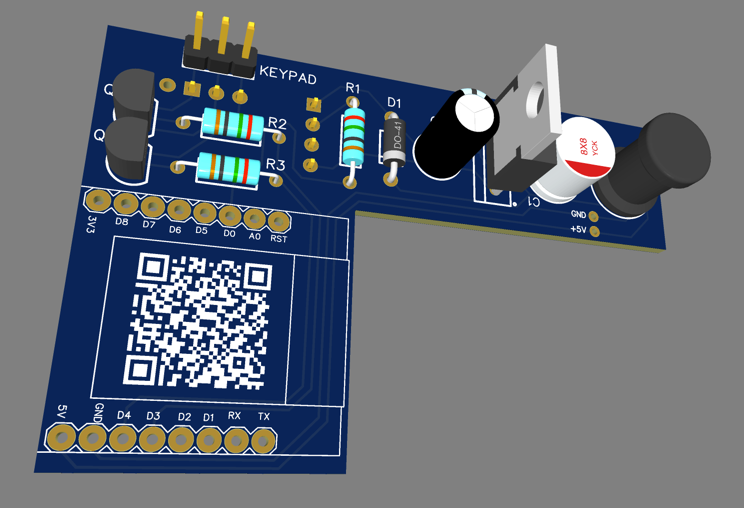

# Sommer Pro+ to ESP Adapter (Wemos mini boards)

This project lets you control a Sommer Pro+ garage door using a
printed circuit board that's easy to solder thanks to only
through-hole components and a plug and play design. The board
simply clips into your wall control.

**Features :**

- Control opening and closing
- Retrieve door open or closed status
- Retrieve the status of the carriage lamp (⚠️Untested yet)
- Forward original Keypad and Light connector

**Compatible doors :** S 9050 pro / S 9050 pro+ / S 9060 pro / S 9060 pro+ / S 9080 pro / S 9080 pro+ / S 9110 pro / S
9110 pro+

**Compatible boards:
** [D1 mini (ESP8266)][D1], [D1 mini Lite (ESP-8285)][D1l], [S2 mini (ESP32-S2FN4R2)][S3], [C3 mini (ESP32-C3FH4)][C3], [S3 mini (ESP32-S3FH4R2)][S3]

> [!TIP]
> If you are looking for a Zigbee or Thread version,
> you can easily use a [ProtoBoard](https://www.wemos.cc/en/latest/d1_mini_shield/protoboard.html) to adapt the D1
> pins with another smaller ESP32-C6 or ESP32-H2 board.

# ⚙️ Hardware

| [](hardware-illustration.png) | [](hardware-reallife.png) |
|--------------------------------------------------------------------|------------------------------------------------------------|

**🏄‍♂️ The PCB :**

View on : https://oshwlab.com/camillebaronnet/sommer-pro-esp32

**🛒 The shopping list :**

Components :

| Location       | Type             | Helpful information                                                                                                        |
|----------------|------------------|----------------------------------------------------------------------------------------------------------------------------|
| R1             | 10k              |                                                                                                                            |
| C1             | 100uF            |                                                                                                                            |
| C2, C3, C4, C5 | 220uF            | The sum of all the capacitors C2 to C6 should be around 1000uF. You can put only 2x470uF or one 1000uF capacitor directly. |
| L1             | 100uH            | Package D4xL10.5mm                                                                                                         | 
| D1             | Schottky Barrier |                                                                                                                            |
| Q1, Q2         | MOSFET CANAL-N   | Exemple 2N2222 or 2N7000                                                                                                   | 

Connectors :

| Location    | Type                        | Helpful information |
|-------------|-----------------------------|---------------------|
| LIGHT       | (todo)                      |                     | 
| LIGHT (L R) | (todo)                      |                     | 
| KEYPAD      | Dupont 2.54mm Male 3 pins   |                     | 
| H1          | Dupont 2.54mm Female 4 pins |                     | 
| H2          | Dupont 2.54mm Female 3 pins |                     | 

# 🧑‍💻 Software

## ESPHome configuration example

Append this part to your existing ESPHome configuration :

```yaml
binary_sensor:
  - platform: gpio
    pin: GPIO16
    name: "Door status"
    id: door_status
    device_class: "door"
  - platform: gpio
    pin: GPIO14
    name: "Light status"
    device_class: "light"


switch:
  - platform: gpio
    pin: GPIO2
    id: open_door
    name: "Open"
    icon: "mdi:gate"
    on_turn_on:
      - delay: 1000ms
      - switch.turn_off: open_door
    internal: true

  - platform: gpio
    pin: GPIO0
    id: close_door
    name: "Close"
    icon: "mdi:gate"
    on_turn_on:
      - delay: 1000ms
      - switch.turn_off: close_door
    internal: true

cover:
  - platform: template
    device_class: garage
    name: "Control"
    open_action:
      - switch.turn_on: open_door
    close_action:
      - switch.turn_on: close_door
    stop_action:
      - switch.turn_off: close_door
      - switch.turn_off: open_door
    lambda: |-
      if (id(door_status).state) {
        return COVER_OPEN;
      } else {
        return COVER_CLOSED;
      }
```

[D1]: https://www.wemos.cc/en/latest/d1/d1_mini.html

[D1l]: https://www.wemos.cc/en/latest/d1/d1_mini_lite.html

[S2]: https://www.wemos.cc/en/latest/s2/s2_mini.html

[C3]: https://www.wemos.cc/en/latest/c3/c3_mini.html

[S3]: https://www.wemos.cc/en/latest/s3/s3_mini.html
