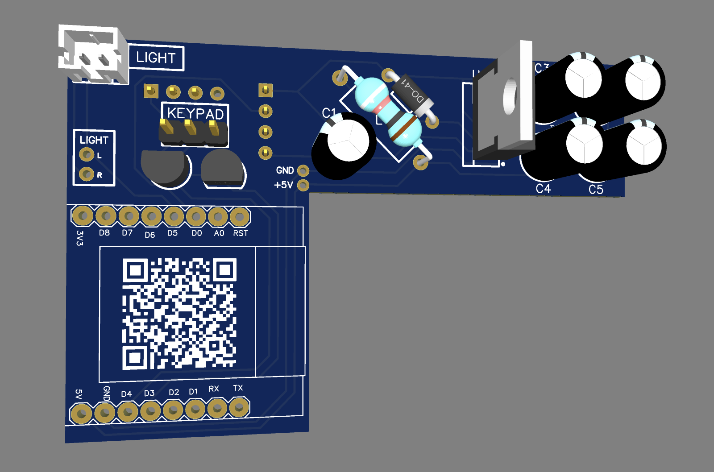

# Sommer Pro+ to D1 Mini Adapter (ESP8266)

This project lets you control a Sommer Pro+ garage door using a printed circuit board that's easy to solder thanks to only through-hole components and a plug'n'play design. The board simply clips into the wall control.

**Features :** 

- Control door opening and closing
- Retrieve door open or closed status

> [!TIP]
> The ESP8266 is the previous version of the ESP32.
> It is only equipped with Wi-Fi. It was chosen for
> It was chosen for this project because of the size of the D1 mini board.

**Compatible doors :** S 9050 pro / S 9050 pro+ / S 9060 pro / S 9060 pro+ / S 9080 pro / S 9080 pro+ / S 9110 pro / S 9110 pro+

# ⚙️ Hardware



**🏄‍♂️ The board :**

*(todo)*

**🛒 The shopping list :**

| Location | Type      | Helpful information              |
|----------|-----------|----------------------------------|
| R1       | 10k       |                                  |
| R2, R3   | 1k        |                                  |
| C1       | 1000uF    |                                  |
| C2       | 100uF     |                                  |
| D1       | /         | Prefer a Schottky Barrier Diodes |
| L2       | 100uH     |                                  | 
| Q1, Q2   | 2N2222    |                                  | 
| U1       | D1 mini   |                                  | 
| U2       | LM2576T-5 | Be careful to the "-5" for 5V    | 

# 🧑‍💻 Software


*(todo)*

## ESPHome configuration

```yaml
# [...]
binary_sensor:
  - platform: gpio
    pin: GPIO16
    name: "Door status"
    device_class: "door"

switch:
  - platform: gpio
    pin: GPIO0
    id: open_door
    name: "Open door"
    icon: "mdi:gate"
    on_turn_on:
    - delay: 1000ms
    - switch.turn_off: open_door

  - platform: gpio
    pin: GPIO2
    id: close_door
    name: "Close door"
    icon: "mdi:gate"
    on_turn_on:
    - delay: 1000ms
    - switch.turn_off: close_door
```
